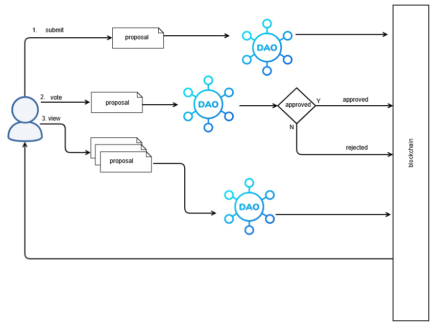

# 🏛️ Campus Micro-Grant DAO DApp

## Empowering Student Initiatives Through Decentralized Funding

## 🚀 Overview

University clubs and student groups often face significant challenges in securing funding for their small but impactful initiatives like events, equipment, or welfare projects. Traditional funding processes can be opaque, slow, and bureaucratic, leading to missed opportunities and frustration.

This project introduces the **Campus Micro-Grant DAO DApp**, a decentralized application designed to revolutionize how student groups access small-scale funding. By leveraging blockchain technology, it creates a transparent, efficient, and community-driven system where students can propose micro-grant requests, the community can vote on them, and funds are disbursed automatically upon approval, all recorded immutably on-chain.

## ✨ Features

The Campus Micro-Grant DAO DApp is a lightweight decentralized application that provides the following core functionalities:

*   **Proposal Submission:** Students and clubs can easily submit proposals for micro-grants, including a title, a detailed description (stored off-chain), and the requested budget.
*   **Community Voting:** Implements a basic governance model where the university community can transparently vote on active proposals.
*   **Automated Approval & Release Tracking:** The system automatically approves or rejects proposals based on voting outcomes and tracks the release of funds.
*   **User-Friendly Frontend:** A web interface for submitting new proposals, viewing all active votes, and checking the status of funded projects.
*   **Public Dashboard:** A comprehensive public dashboard showcasing the full history of proposals, fund allocations, and the DAO's overall activity.
*   **Real DAO Mechanics:** Demonstrates core Decentralized Autonomous Organization principles in a practical campus context.

## 💡 Core Principles & DAO Mechanics

This DApp embodies the fundamental principles of a Decentralized Autonomous Organization:

*   **Decentralization:** No single central authority controls funding decisions; power is distributed among community members.
*   **Transparency:** All proposals, votes, and fund disbursements are recorded on a public blockchain, ensuring auditability and trust.
*   **Autonomy:** Rules for voting and fund release are encoded in smart contracts, executing automatically without human intervention.
*   **Community Governance:** Decisions are made collectively by the community through a voting process.

## 📐 Design Details

### Actors

*   **Community Groups / Student Groups:** The entities that propose initiatives and request micro-grants.
*   **Community / Student Members:** Individuals who participate in the voting process.
*   **DAO Governance Members:** (In this simple iteration, these are effectively the Community / Student Members who vote).

### Proposal Types

Proposals can be categorized to help voters understand their purpose:

*   Events
*   Equipment Purchase
*   Welfare Projects

### Event Definition

A proposal event, as recorded on-chain, will have the following structure:

```json
{
    "title": "Sports Event",
    "descriptionHash": "Qm... (IPFS hash of detailed description)",
    "budget": "2500000" // Amount in smallest unit (e.g., Wei)
}
```

### High-Level Architecture Diagram



### DAO Governance Rules

The initial governance rules for this DAO are designed for simplicity and direct community participation:

*   **Voting Mechanism:** Each unique wallet address will have **one vote** per proposal (One-Wallet-One-Vote).
*   **Approval Rule:** A proposal is approved if the number of votes **in favor** is strictly greater than the number of votes **against**. (This implies a simple majority rule, assuming a quorum is met, which would be handled by the smart contract).

## ➡️ User Flows

### 1. Proposal Submission Flow

1.  **Student/Club Leader** connects their Web3 wallet to the DApp.
2.  Navigates to the "Submit Proposal" section.
3.  Fills out the proposal form (title, detailed description, budget request).
4.  The DApp uploads the detailed description to an off-chain storage solution (like IPFS) and obtains a content hash.
5.  The DApp then sends a transaction to the DAO smart contract, including the title, the `descriptionHash`, and the `budget` ask.
6.  The proposal is recorded on the blockchain with a unique ID and enters an "Active" voting state.
7.  The user can view their submitted proposal on the DApp.

### 2. Voting Flow

1.  **Community/Student Member** connects their Web3 wallet to the DApp.
2.  Navigates to the "Active Proposals" section.
3.  Selects a proposal to review its details (fetching the full description from IPFS using the `descriptionHash`).
4.  Casts their vote ("Yes" or "No") for the proposal.
5.  The DApp sends a transaction to the DAO smart contract to record the vote.
6.  The vote is recorded on the blockchain, updating the proposal's vote counts.

### 3. Approval & Execution Flow

1.  Once a proposal's voting period ends, any community member can trigger the `endVoting` function on the smart contract.
2.  The DAO smart contract automatically evaluates the votes based on the defined governance rules (e.g., "Votes in favour > Votes not in favour").
3.  If approved, the proposal's status is updated to "Approved."
4.  Any community member can then trigger the `executeProposal` function for an "Approved" proposal.
5.  The DAO smart contract automatically transfers the requested `budget` from the DAO's treasury to the proposer's wallet.
6.  The proposal's status is updated to "Executed," and the transaction is recorded on the blockchain.
7.  The public dashboard reflects the updated status and fund allocation.

## 🛠️ Technologies (Expected)

*   **Blockchain:** Ethereum Testnet (e.g., Sepolia) or Polygon Testnet (e.g., Mumbai)
*   **Smart Contracts:** Solidity
*   **Frontend:** React.js (or similar framework), Ethers.js/Web3.js
*   **Off-chain Storage:** IPFS / Arweave for proposal descriptions

## ⚙️ Setup and Installation (Placeholder)

Instructions for setting up the development environment, deploying smart contracts, and running the frontend will be provided here.

## 🚀 Usage (Placeholder)

Detailed guide on how to interact with the DApp, submit proposals, vote, and view the dashboard.

## 🤝 Contributing (Placeholder)

Guidelines for contributing to the project, including how to report bugs, suggest features, and submit pull requests.

## 📄 License (Placeholder)

Information about the project's licensing.


## Foundry Commands of running the project

**Foundry is a blazing fast, portable and modular toolkit for Ethereum application development written in Rust.**

Foundry consists of:

- **Forge**: Ethereum testing framework (like Truffle, Hardhat and DappTools).
- **Cast**: Swiss army knife for interacting with EVM smart contracts, sending transactions and getting chain data.
- **Anvil**: Local Ethereum node, akin to Ganache, Hardhat Network.
- **Chisel**: Fast, utilitarian, and verbose solidity REPL.

## Documentation

https://book.getfoundry.sh/

## Usage

### Build

```shell
$ forge build
```

### Test

```shell
$ forge test
```

### Format

```shell
$ forge fmt
```

### Gas Snapshots

```shell
$ forge snapshot
```

### Anvil

```shell
$ anvil
```

### Deploy

```shell
$ forge script script/Counter.s.sol:CounterScript --rpc-url <your_rpc_url> --private-key <your_private_key>
```

### Cast

```shell
$ cast <subcommand>
```

### Help

```shell
$ forge --help
$ anvil --help
$ cast --help
```
